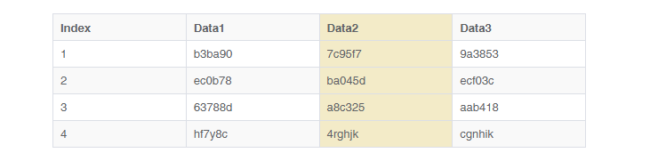
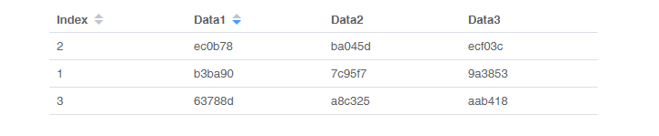
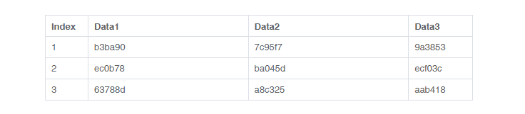
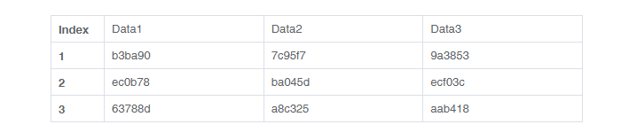

# vue-table-dynamic

[vue-table-dynamic](https://github.com/TheoXiong/vue-table-dynamic) 是一个动态表格组件

## 特性
- 面向运行时，实时响应源数据变化，动态更新表格内容与形态
- 行多选
- 搜索过滤
- 指定列排序
- 配置列宽度
- 固定表头
- 指定 行/列/单元 可编辑
- 指定 行/列/单元 高亮背景
- 指定列筛选（开发中）
- 分页（开发中）
- 通过作用域插槽自定义表格单元内容（开发中）
- 所有特性均可按需配置启用或禁用


## Demo
[https://theoxiong.github.io/vue-table-dynamic/](https://theoxiong.github.io/vue-table-dynamic/) 


## 安装
``` 
$   npm install vue-table-dynamic --save
```

## 使用

### 引入模块
```
import VueTableDynamic from 'vue-table-dynamic'
```

### 注册
#### 全局注册
```
Vue.use(VueTableDynamic)
```
#### 组件内注册
```
<script>
export default {
  components: { VueTableDynamic }
}
</script>
```

### 基础表格

基础表格用法


```
<template>
  <div class="base-demo" style="width: 400px">
    <vue-table-dynamic :params="params"></vue-table-dynamic>
  </div>
</template>

<script>
import VueTableDynamic from 'vue-table-dynamic'

export default {
  name: 'Demo',
  data() {
    return {
      params: {
        data: [
          ['Cell-1', 'Cell-2', 'Cell-3'],
          ['Cell-4', 'Cell-5', 'Cell-6'],
          ['Cell-7', 'Cell-8', 'Cell-9']
        ]
      }
    }
  },
  components: { VueTableDynamic }
}

</script>
```

### 边框

配置`border`属性，使用带边框表格
   

```
<template>
  <div style="width: 600px">
    <vue-table-dynamic :params="params" ref="table"></vue-table-dynamic>
  </div>
</template>

<script>
import VueTableDynamic from 'vue-table-dynamic'
export default {
  name: 'Demo',
  data() {
    return {
      params: {
        data: [
          ['Index', 'Data1', 'Data2', 'Data3'],
          [1, 'b3ba90', '7c95f7', '9a3853'],
          [2, 'ec0b78', 'ba045d', 'ecf03c'],
          [3, '63788d', 'a8c325', 'aab418']
        ],
        header: 'row',
        border: true
      }
    }
  },
  components: { VueTableDynamic }
}
</script>
```

### 条纹与高亮

配置`stripe`属性，显示行条纹      
配置`highlight`属性，指定行/列/单元高亮        
通过`highlightedColor`属性，设置高亮背景色      

> `highlight`类型为`{row?: Array<number>; column?: Array<number>; cell?: Array<[number,number]>;}`。如：`{row: [1], column: [1], cell: [[-1, -1]]}`，负数表示倒序索引 

   

```
<template>
  <div style="width: 600px">
    <vue-table-dynamic :params="params" ref="table"></vue-table-dynamic>
  </div>
</template>

<script>
import VueTableDynamic from 'vue-table-dynamic'
export default {
  name: 'Demo',
  data() {
    return {
      params: {
        data: [
          ['Index', 'Data1', 'Data2', 'Data3'],
          [1, 'b3ba90', '7c95f7', '9a3853'],
          [2, 'ec0b78', 'ba045d', 'ecf03c'],
          [3, '63788d', 'a8c325', 'aab418'],
          [4, 'hf7y8c', '4rghjk', 'cgnhik']
        ],
        header: 'row',
        border: true,
        stripe: true,
        highlight: { column: [-2] },
        highlightedColor: 'rgb(243, 235, 200)'
      }
    }
  },
  components: { VueTableDynamic }
}
</script>
```

### 多选

配置`showCheck`属性，启用多选特性         
> 通过`select`事件和`selection-change`事件，监听用户勾选操作      
> 通过`getCheckedRowDatas`方法获取当前所有选中的行数据      
> 通过`setAllRowChecked`方法将选中状态切换为全选或清空选择             

   

```
<template>
  <div style="width: 600px">
    <vue-table-dynamic 
      :params="params" 
      @select="onSelect" 
      @selection-change="onSelectionChange"
      ref="table"
    >
    </vue-table-dynamic>
  </div>
</template>

<script>
import VueTableDynamic from 'vue-table-dynamic'
export default {
  name: 'Demo',
  data() {
    return {
      params: {
        data: [
          ['Index', 'Data1', 'Data2', 'Data3'],
          [1, 'b3ba90', '7c95f7', '9a3853'],
          [2, 'ec0b78', 'ba045d', 'ecf03c'],
          [3, '63788d', 'a8c325', 'aab418']
        ],
        header: 'row',
        showCheck: true
      }
    }
  },
  methods: {
    onSelect (isChecked, index, data) {
      console.log('onSelect: ', isChecked, index, data)
      console.log('Checked Data:', this.$refs.table.getCheckedRowDatas(true))
    },
    onSelectionChange (checkedDatas, checkedIndexs, checkedNum) {
      console.log('onSelectionChange: ', checkedDatas, checkedIndexs, checkedNum)
    }
  },
  components: { VueTableDynamic }
}
</script>
```

### 搜索过滤

配置`enableSearch`属性，启用行搜索特性
> 通过`filter`方法可以手动对行过滤，适用于自定义搜索框（配置`enableSearch`为`false`）     

   

```
<template>
  <div style="width: 600px">
    <vue-table-dynamic 
      :params="params" 
      ref="table"
    >
    </vue-table-dynamic>
  </div>
</template>

<script>
import VueTableDynamic from 'vue-table-dynamic'
export default {
  name: 'Demo',
  data() {
    return {
      params: {
        data: [
          ['Index', 'Data1', 'Data2', 'Data3'],
          [1, 'b3ba90', '7c95f7', '9a3853'],
          [2, 'ec0b78', 'ba045d', 'ecf03c'],
          [3, '63788d', 'a8c325', 'aab418']
        ],
        header: 'row',
        enableSearch: true
      }
    }
  },
  methods: {
  },
  components: { VueTableDynamic }
}
</script>
```

### 排序

配置`sort`属性，启用排序特性      
> `sort`类型为`Array<number>`，数组成员为启用排序的列索引。如：`sort: [0, 1]`，基于第0列和第1列排序 

  

```
<template>
  <div style="width: 600px">
    <vue-table-dynamic 
      :params="params" 
      ref="table"
    >
    </vue-table-dynamic>
  </div>
</template>

<script>
import VueTableDynamic from 'vue-table-dynamic'
export default {
  name: 'Demo',
  data() {
    return {
      params: {
        data: [
          ['Index', 'Data1', 'Data2', 'Data3'],
          [1, 'b3ba90', '7c95f7', '9a3853'],
          [2, 'ec0b78', 'ba045d', 'ecf03c'],
          [3, '63788d', 'a8c325', 'aab418']
        ],
        header: 'row',
        sort: [0, 1]
      }
    }
  },
  methods: {
  },
  components: { VueTableDynamic }
}
</script>
```

### 编辑

配置`edit`属性，启用排序特性   
> `edit`类型为`{row?: Array<number>; column?: Array<number>; cell?: Array<[number,number]>;}`。如：`{row: [1], column: [1], cell: [[-1, -1]]}`，负数表示倒序索引       
> 配置为`{row: 'all'}`时，所有单元均可编辑        
> 通过`cell-change`事件，监听编辑操作        
> 通过`getData`方法，获取最新表格数据       
> 如果配置了 `header: 'row'`，则第一行表头不可编辑       

  

```
<template>
  <div style="width: 600px">
    <vue-table-dynamic 
      :params="params"
      @cell-change="onCellChange"
      ref="table"
    >
    </vue-table-dynamic>
  </div>
</template>

<script>
import VueTableDynamic from 'vue-table-dynamic'
export default {
  name: 'Demo',
  data() {
    return {
      params: {
        data: [
          ['Index', 'Data1', 'Data2', 'Data3'],
          [1, 'b3ba90', '7c95f7', '9a3853'],
          [2, 'ec0b78', 'ba045d', 'ecf03c'],
          [3, '63788d', 'a8c325', 'aab418']
        ],
        header: 'row',
        edit: {
          row: [1],
          column: [1],
          cell: [[-1, -1]]
        }
      }
    }
  },
  methods: {
    onCellChange (rowIndex, columnIndex, data) {
      console.log('onCellChange: ', rowIndex, columnIndex, data)
      console.log('table data: ', this.$refs.table.getData())
    }
  },
  components: { VueTableDynamic }
}
</script>
```

### 列宽
通过`columnWidth`属性配置表格列宽度
> `columnWidth`类型为`Array<{column: number; width: number;}>`。如：`[{column: 0, width: 60}, {column: 3, width: '15%'}]`

  

```
<template>
  <div style="width: 600px">
    <vue-table-dynamic :params="params" ref="table"></vue-table-dynamic>
  </div>
</template>

<script>
import VueTableDynamic from 'vue-table-dynamic'
export default {
  name: 'Demo',
  data() {
    return {
      params: {
        data: [
          ['Index', 'Data1', 'Data2', 'Data3'],
          [1, 'b3ba90', '7c95f7', '9a3853'],
          [2, 'ec0b78', 'ba045d', 'ecf03c'],
          [3, '63788d', 'a8c325', 'aab418']
        ],
        header: 'row',
        border: true,
        columnWidth: [{column: 0, width: 60}, {column: 3, width: '15%'}],
      }
    }
  },
  components: { VueTableDynamic }
}
</script>
```

### 表头

通过`header`属性配置表头，表头文字加粗显示
> `row`: 表头在第一行；`column`: 表头在第一列； 其他值（或不配置）表示无表头

  

```
<template>
  <div style="width: 600px">
    <vue-table-dynamic :params="params" ref="table"></vue-table-dynamic>
  </div>
</template>

<script>
import VueTableDynamic from 'vue-table-dynamic'
export default {
  name: 'Demo',
  data() {
    return {
      params: {
        data: [
          ['Index', 'Data1', 'Data2', 'Data3'],
          [1, 'b3ba90', '7c95f7', '9a3853'],
          [2, 'ec0b78', 'ba045d', 'ecf03c'],
          [3, '63788d', 'a8c325', 'aab418']
        ],
        header: 'column',
        border: true,
        columnWidth: [{column: 0, width: 60}]
      }
    }
  },
  components: { VueTableDynamic }
}
</script>
```
## API


