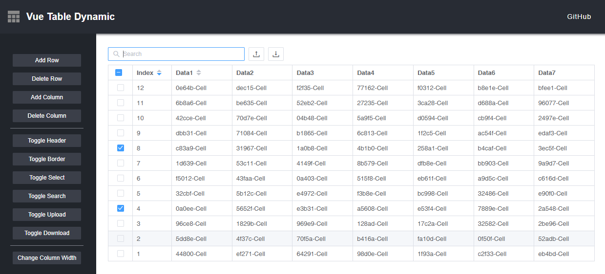
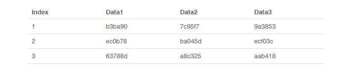
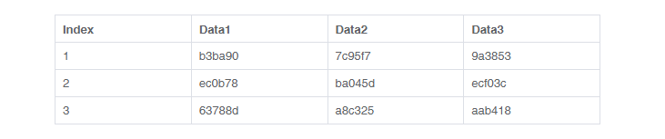
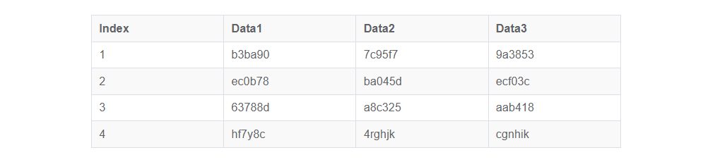
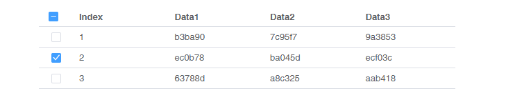
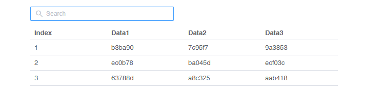
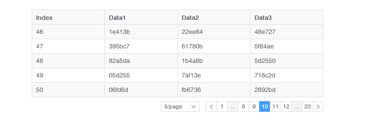
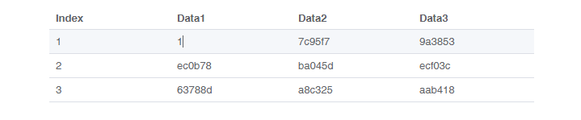
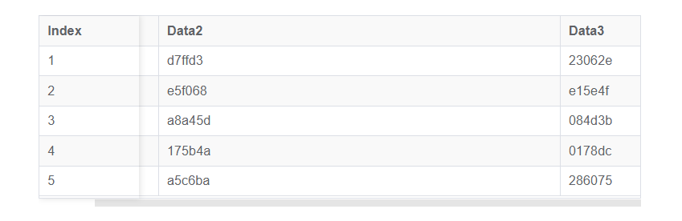
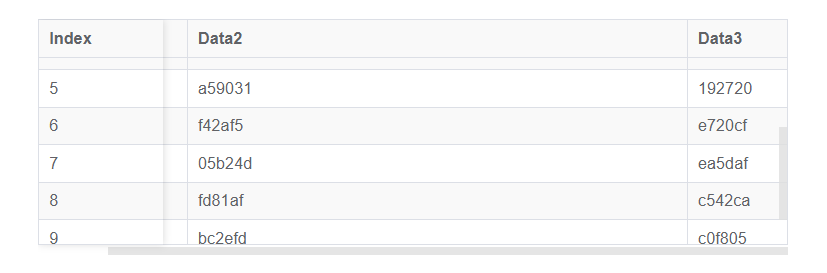

# vue-table-dynamic

English | [简体中文](./README.zh-CN.md)

[vue-table-dynamic](https://github.com/TheoXiong/vue-table-dynamic) is a vue component of dynamic table. It's designed to respond to data changes in real time, and oriented to the runtime.    

## Features
- Multiple Select
- Search
- Sort
- Filter
- Pagination
- Edit
- Border
- Stripe
- Highlight
- Column Width
- Configure Header
- Fixed Header
- Fixed Columns
- Slot

## Demo
[https://theoxiong.github.io/vue-table-dynamic/](https://theoxiong.github.io/vue-table-dynamic/) 



## Install
``` 
$   npm install vue-table-dynamic --save
```

## Usage

### Import
```
import VueTableDynamic from 'vue-table-dynamic'
```

### Registration
#### Global registration
```
Vue.use(VueTableDynamic)
```
#### Local registration
```
<script>
export default {
  components: { VueTableDynamic }
}
</script>
```

### Basic Table

Basic table usage



```
<template>
  <div class="base-demo" style="width: 400px">
    <vue-table-dynamic :params="params"></vue-table-dynamic>
  </div>
</template>

<script>
import VueTableDynamic from 'vue-table-dynamic'

export default {
  name: 'Demo',
  data() {
    return {
      params: {
        data: [
          ['Cell-1', 'Cell-2', 'Cell-3'],
          ['Cell-4', 'Cell-5', 'Cell-6'],
          ['Cell-7', 'Cell-8', 'Cell-9']
        ]
      }
    }
  },
  components: { VueTableDynamic }
}

</script>
```

### Border

Bordered table usage

- `border:`*`true`* with border
- `border:`*`false`* without border

   

```
<template>
  <div style="width: 600px">
    <vue-table-dynamic :params="params" ref="table"></vue-table-dynamic>
  </div>
</template>

<script>
import VueTableDynamic from 'vue-table-dynamic'
export default {
  name: 'Demo',
  data() {
    return {
      params: {
        data: [
          ['Index', 'Data1', 'Data2', 'Data3'],
          [1, 'b3ba90', '7c95f7', '9a3853'],
          [2, 'ec0b78', 'ba045d', 'ecf03c'],
          [3, '63788d', 'a8c325', 'aab418']
        ],
        header: 'row',
        border: true
      }
    }
  },
  components: { VueTableDynamic }
}
</script>
```

### Stripe

Striped rows

- `stripe:`*`true`* striped   
- `stripe:`*`false`* unstriped      



```
<template>
  <div style="width: 600px">
    <vue-table-dynamic :params="params" ref="table"></vue-table-dynamic>
  </div>
</template>

<script>
import VueTableDynamic from 'vue-table-dynamic'
export default {
  name: 'Demo',
  data() {
    return {
      params: {
        data: [
          ['Index', 'Data1', 'Data2', 'Data3'],
          [1, 'b3ba90', '7c95f7', '9a3853'],
          [2, 'ec0b78', 'ba045d', 'ecf03c'],
          [3, '63788d', 'a8c325', 'aab418'],
          [4, 'hf7y8c', '4rghjk', 'cgnhik']
        ],
        header: 'row',
        border: true,
        stripe: true
      }
    }
  },
  components: { VueTableDynamic }
}
</script>
```

### Highlight

Highlighted rows/columns/cells

- `highlight:`*`{row?:Array<number>; column?:Array<number>; cell?:Array<[number,number]>;}`* configure highlighted rows, columns, cells. such as: *`{row: [1], column: [1], cell: [[-1, -1]]}`* if negative, the position from the end of the array.
- `highlightedColor:`*`string`* configure highlighted colors 

   

```
<template>
  <div style="width: 600px">
    <vue-table-dynamic :params="params" ref="table"></vue-table-dynamic>
  </div>
</template>

<script>
import VueTableDynamic from 'vue-table-dynamic'
export default {
  name: 'Demo',
  data() {
    return {
      params: {
        data: [
          ['Index', 'Data1', 'Data2', 'Data3'],
          [1, 'b3ba90', '7c95f7', '9a3853'],
          [2, 'ec0b78', 'ba045d', 'ecf03c'],
          [3, '63788d', 'a8c325', 'aab418'],
          [4, 'hf7y8c', '4rghjk', 'cgnhik']
        ],
        header: 'row',
        border: true,
        stripe: true,
        highlight: { column: [-2] },
        highlightedColor: 'rgb(243, 235, 200)'
      }
    }
  },
  components: { VueTableDynamic }
}
</script>
```

### Multiple Select

Select multiple rows

- `showCheck:`*`boolean`* show checkbox of rows
- `getCheckedRowDatas:`*`function`* get data for all currently selected rows
- `setAllRowChecked:`*`function(selected:boolean)`* toggle all selection
- `select:`*`event`* currently selected/unselected rows            

   

```
<template>
  <div style="width: 600px">
    <vue-table-dynamic 
      :params="params" 
      @select="onSelect" 
      @selection-change="onSelectionChange"
      ref="table"
    >
    </vue-table-dynamic>
  </div>
</template>

<script>
import VueTableDynamic from 'vue-table-dynamic'
export default {
  name: 'Demo',
  data() {
    return {
      params: {
        data: [
          ['Index', 'Data1', 'Data2', 'Data3'],
          [1, 'b3ba90', '7c95f7', '9a3853'],
          [2, 'ec0b78', 'ba045d', 'ecf03c'],
          [3, '63788d', 'a8c325', 'aab418']
        ],
        header: 'row',
        showCheck: true
      }
    }
  },
  methods: {
    onSelect (isChecked, index, data) {
      console.log('onSelect: ', isChecked, index, data)
      console.log('Checked Data:', this.$refs.table.getCheckedRowDatas(true))
    },
    onSelectionChange (checkedDatas, checkedIndexs, checkedNum) {
      console.log('onSelectionChange: ', checkedDatas, checkedIndexs, checkedNum)
    }
  },
  components: { VueTableDynamic }
}
</script>
```

### Search

Filter rows by keyword

- `enableSearch:`*`boolean`* enable/disable searching
- `search:`*`function(value:string, included:array, excluded:array)`* manual row filtering     

   

```
<template>
  <div style="width: 600px">
    <vue-table-dynamic 
      :params="params" 
      ref="table"
    >
    </vue-table-dynamic>
  </div>
</template>

<script>
import VueTableDynamic from 'vue-table-dynamic'
export default {
  name: 'Demo',
  data() {
    return {
      params: {
        data: [
          ['Index', 'Data1', 'Data2', 'Data3'],
          [1, 'b3ba90', '7c95f7', '9a3853'],
          [2, 'ec0b78', 'ba045d', 'ecf03c'],
          [3, '63788d', 'a8c325', 'aab418']
        ],
        header: 'row',
        enableSearch: true
      }
    }
  },
  methods: {
  },
  components: { VueTableDynamic }
}
</script>
```

### Sort

Sort rows based on specified column data

- `sort:`*`Array<number>`* array members are sortable column indexes. such as: *`[0, 1]`*

  

```
<template>
  <div style="width: 600px">
    <vue-table-dynamic 
      :params="params" 
      ref="table"
    >
    </vue-table-dynamic>
  </div>
</template>

<script>
import VueTableDynamic from 'vue-table-dynamic'
export default {
  name: 'Demo',
  data() {
    return {
      params: {
        data: [
          ['Index', 'Data1', 'Data2', 'Data3'],
          [1, 'b3ba90', '7c95f7', '9a3853'],
          [2, 'ec0b78', 'ba045d', 'ecf03c'],
          [3, '63788d', 'a8c325', 'aab418']
        ],
        header: 'row',
        sort: [0, 1]
      }
    }
  },
  methods: {
  },
  components: { VueTableDynamic }
}
</script>
```

### Filter

Filter rows based on specified column data and rule

- `filter:`*`Array<{column:number; content:Array<{text:string; value:string|number;}>; method:function;}>`* specify filterable columns and rules. such as: *`[{column: 0, content: [{text: '> 2', value: 2}], method: (value, cell) => { return cell.data > value }}]`*
- `filter[].column:` column index
- `filter[].content:` filter items
- `filter[].method:` filter rule.     

 

```
<template>
  <div style="width: 600px">
    <vue-table-dynamic 
      :params="params" 
      ref="table"
    >
    </vue-table-dynamic>
  </div>
</template>

<script>
import VueTableDynamic from 'vue-table-dynamic'
export default {
  name: 'Demo',
  data() {
    return {
      params: {
        data: [
          ['Index', 'Data1', 'Data2', 'Time'],
          [1, 'b3ba90', '9a3853', '2019-01-01 10:10'],
          [2, 'ec0b78', 'ecf03c', '2019-02-02 11:11'],
          [3, '7c95f7', 'fdf451', '2019-02-02 12:12'],
          [4, 'ba045d', '34fdgh', '2019-02-02 13:13'],
          [5, 'a8c325', '4678de', '2019-03-03 14:14']
        ],
        header: 'row',
        filter: [{
          column: 0, 
          content: [{text: '> 2', value: 2}, {text: '> 4', value: 4}], 
          method: (value, tableCell) => { return tableCell.data > value }
        }, {
          column: 3, 
          content: [{text: '2019-01-01', value: '2019-01-01'}, {text: '2019-02-02', value: '2019-02-02'}], 
          method: (value, tableCell) => { return String(tableCell.data).toLocaleLowerCase().includes(String(value).toLocaleLowerCase()) }
        }],
      }
    }
  },
  methods: {
  },
  components: { VueTableDynamic }
}
</script>
```

### Pagination

Table with pagination

- `pagination:`*`boolean`* enable/disable pagination
- `pageSize?:`*`number`* row count of each page. default: *`10`*
- `pageSizes?:`*`Array<number>`* options of row count per page. default: *`[10, 20, 50, 100]`*        

  

```
<template>
  <div style="width: 600px">
    <vue-table-dynamic 
      :params="params" 
      ref="table"
    >
    </vue-table-dynamic>
  </div>
</template>

<script>
import VueTableDynamic from 'vue-table-dynamic'

const random = () => {
  return parseInt(Date.now() + Math.random() * 10000000).toString(16).slice(-6)
}

export default {
  name: 'Demo',
  data() {
    return {
      params: {
        data: [
          ['Index', `Data1`, `Data2`, `Data3`]
        ],
        header: 'row',
        border: true,
        stripe: true,
        pagination: true,
        pageSize: 5,
        pageSizes: [5, 10, 20, 50]
      }
    }
  },
  mounted () {
    for (let i = 0; i < 100; i++) {
      this.params.data.push([i+1, `${random()}`, `${random()}`, `${random()}`])
    }
  },
  components: { VueTableDynamic }
}
</script>
```

### Edit

Editable table     
Support specifying rows/columns/cells for editing

- `edit:`*`{row?:Array<number>; column?:Array<number>; cell?:Array<[number,number]>;}`* configure editable rows, columns, cells. such as: *`{row: [1], column: [1], cell: [[-1, -1]]}`*. if negative, the position from the end of the array.
- `getData:`*`function()`* table data changed after editing, get the latest data by this method.
- `cell-change:`*`event`* cell data changed event
- `edit:`*`{row: 'all'}`* all cells can be edited      
- if `header` is *`'row'`*, the first row is not editable    
- if the type of source data item is `number`, only acceptable when entering numbers    

  

```
<template>
  <div style="width: 600px">
    <vue-table-dynamic 
      :params="params"
      @cell-change="onCellChange"
      ref="table"
    >
    </vue-table-dynamic>
  </div>
</template>

<script>
import VueTableDynamic from 'vue-table-dynamic'
export default {
  name: 'Demo',
  data() {
    return {
      params: {
        data: [
          ['Index', 'Data1', 'Data2', 'Data3'],
          [1, 'b3ba90', '7c95f7', '9a3853'],
          [2, 'ec0b78', 'ba045d', 'ecf03c'],
          [3, '63788d', 'a8c325', 'aab418']
        ],
        header: 'row',
        edit: {
          row: [1],
          column: [1],
          cell: [[-1, -1]]
        }
      }
    }
  },
  methods: {
    onCellChange (rowIndex, columnIndex, data) {
      console.log('onCellChange: ', rowIndex, columnIndex, data)
      console.log('table data: ', this.$refs.table.getData())
    }
  },
  components: { VueTableDynamic }
}
</script>
```

### Column width

Configure column width

- `columnWidth:`*`Array<{column:number; width:number|string;}>`* such as: *`[{column: 0, width: 60}, {column: 3, width: '15%'}]`*
- `columnWidth[].column` index of column
- `columnWidth[].width` width of column. number for pixel value, string for percentage

  

```
<template>
  <div style="width: 600px">
    <vue-table-dynamic :params="params" ref="table"></vue-table-dynamic>
  </div>
</template>

<script>
import VueTableDynamic from 'vue-table-dynamic'
export default {
  name: 'Demo',
  data() {
    return {
      params: {
        data: [
          ['Index', 'Data1', 'Data2', 'Data3'],
          [1, 'b3ba90', '7c95f7', '9a3853'],
          [2, 'ec0b78', 'ba045d', 'ecf03c'],
          [3, '63788d', 'a8c325', 'aab418']
        ],
        header: 'row',
        border: true,
        columnWidth: [{column: 0, width: 60}, {column: 3, width: '15%'}],
      }
    }
  },
  components: { VueTableDynamic }
}
</script>
```

### Header Configure

- `header:`*`row`* the first row is header
- `header:`*`column`* the first column is header
- `header:`*`''`* no header

  

```
<template>
  <div style="width: 600px">
    <vue-table-dynamic :params="params" ref="table"></vue-table-dynamic>
  </div>
</template>

<script>
import VueTableDynamic from 'vue-table-dynamic'
export default {
  name: 'Demo',
  data() {
    return {
      params: {
        data: [
          ['Index', 'Data1', 'Data2', 'Data3'],
          [1, 'b3ba90', '7c95f7', '9a3853'],
          [2, 'ec0b78', 'ba045d', 'ecf03c'],
          [3, '63788d', 'a8c325', 'aab418']
        ],
        header: 'column',
        border: true,
        columnWidth: [{column: 0, width: 60}]
      }
    }
  },
  components: { VueTableDynamic }
}
</script>
```

### Fixed Header

Fixed header by configure the height of table

- `height:`*`number`* table height
- when the value of `header` is not *`'row'`*, the first row is a normal row, will not fixed      

  

```
<template>
  <div style="width: 600px">
    <vue-table-dynamic 
      :params="params" 
      ref="table"
    >
    </vue-table-dynamic>
  </div>
</template>

<script>
import VueTableDynamic from 'vue-table-dynamic'

const random = () => {
  return parseInt(Date.now() + Math.random() * 10000000).toString(16).slice(-6)
}

export default {
  name: 'Demo',
  data() {
    return {
      params: {
        data: [
          ['Index', `Data1`, `Data2`, `Data3`]
        ],
        header: 'row',
        border: true,
        stripe: true,
        height: 180
      }
    }
  },
  mounted () {
    for (let i = 0; i < 12; i++) {
      this.params.data.push([i+1, `${random()}`, `${random()}`, `${random()}`])
    }
  },
  components: { VueTableDynamic }
}
</script>
```

### Fixed Columns

Fixed columns by configure `fixed`

- `fixed:`*`number`* the fixed columns
- columns with index less than or equal to `fixed` will be configured as fixed. such as `fixed: 1`, the first column and the second column will be fixed
- for fixed columns, need to specify the column width (pixel value) by `columnwidth`
- multi check box is not in the range of fixed column, it's always in front of the first column
- if need to fix a column in the middle, adjust the column data in params.data to column 0



```
<template>
  <div style="width: 600px">
    <vue-table-dynamic :params="params" ref="table"></vue-table-dynamic>
  </div>
</template>

<script>
import VueTableDynamic from 'vue-table-dynamic'

const random = () => {
  return parseInt(Date.now() + Math.random() * 10000000).toString(16).slice(-6)
}

export default {
  name: 'Demo',
  data() {
    return {
      params: {
        data: [
          ['Index', `Data1`, `Data2`, `Data3`]
        ],
        header: 'row',
        border: true,
        stripe: true,
        columnWidth: [{column: 0, width: 100}, {column: 2, width: 400}],
        fixed: 0
      }
    }
  },
  mounted () {
    for (let i = 0; i < 5; i++) {
      this.params.data.push([i+1, `${random()}`, `${random()}`, `${random()}`])
    }
  },
  components: { VueTableDynamic }
}
</script>
```

### Fixed Header and Columns

Fixed header by `height`. Fixed columns by `fixed`



```
<template>
  <div style="width: 600px">
    <vue-table-dynamic :params="params" ref="table"></vue-table-dynamic>
  </div>
</template>

<script>
import VueTableDynamic from 'vue-table-dynamic'

const random = () => {
  return parseInt(Date.now() + Math.random() * 10000000).toString(16).slice(-6)
}

export default {
  name: 'Demo',
  data() {
    return {
      params: {
        data: [
          ['Index', `Data1`, `Data2`, `Data3`]
        ],
        header: 'row',
        border: true,
        stripe: true,
        columnWidth: [{column: 0, width: 100}, {column: 2, width: 400}],
        height: 180,
        fixed: 0
      }
    }
  },
  mounted () {
    for (let i = 0; i < 10; i++) {
      this.params.data.push([i+1, `${random()}`, `${random()}`, `${random()}`])
    }
  },
  components: { VueTableDynamic }
}
</script>
```


### Slot

Customize cell content by slot
The slot name should be `column-n`， `n` is the index of column 

```
<template>
  <div class="base-demo" style="width: 400px">
    <vue-table-dynamic :params="params">
      <template v-slot:column-1="{ props }">
        <span>Slot::{{props.cellData}}--{{props.row}}--{{props.column}}</span>
      </template>
    </vue-table-dynamic>
  </div>
</template>

<script>
import VueTableDynamic from 'vue-table-dynamic'

export default {
  name: 'Demo',
  data() {
    return {
      params: {
        data: [
          ['Cell-1', 'Cell-2', 'Cell-3'],
          ['Cell-4', 'Cell-5', 'Cell-6'],
          ['Cell-7', 'Cell-8', 'Cell-9']
        ]
      }
    }
  },
  components: { VueTableDynamic }
}

</script>
```

## API

### Attributes

- `params` is the object that need to be passed to the component `props`
- the following items are all child properties of the `params` object
- `data` is required attribute, others are optional

| name | description | type | optional value | default value |
| -----| ----------- | ---- | -------------- | ------------- |
| `data`   | source data | `Array<[number, ..., number]>` | - | `[]` |
| `header` | configure header | `string` | `row`: the first row is header; `column`: the first column is header; `''`: no header | `''`  |
| `border` | table with border | `boolean` | `true`/`false` | `false` |
| `stripe` | striped table | `boolean` | `true`/`false` | `false` |
| `highlight` | configure highlighted rows, columns, cells. such as: {row: `[1]`, column: `[1]`, cell: `[[-1, -1]]`}. if negative, the position from the end of the array. | {row?:Array<>; column?:Array<>; cell?:Array<>;} | - | `{}` |
| `highlightedColor` | highlighted colors | `string` | - | `#EBEBEF` |
| `wordWrap` | word-wrap style of table cell | `string` | `normal/break-word` | `normal` |
| `whiteSpace` | white-space style of table cell | `string` | `nowrap/normal/pre/pre-wrap/pre-line` | `nowrap` |
| `textOverflow` | text-overflow style of table cell | `string` | `clip/ellipsis` | `clip` |
| `showCheck` | show checkbox of rows. Only when the `header` is `'row'`, the first cell of the first row is the checkbox of all rows. Otherwise, the first cell is the checkbox of the first row | `boolean` | `true`/`false` | `false` |
| `enableSearch` | enable/disable searching, filter rows by keyword | `boolean` | `true`/`false` | `false`   |
| `minWidth` | min width of table | `number` | - | `100` |
| `maxWidth` | max width of table | `number` | - | `10000` |
| `height` | table height. fixed header by configure the height of table | `number` | -  | - |
| `fixed` | fixed columns  | `number`  | `>= 0` |  |
| `headerHeight` | header height  | `number`  | `>= 24` | `30` |
| `rowHeight` | row height  | `number`  | `>= 24` | `30` |
| `columnWidth` | Configure column width | Array<{column:number; width:number/string;}> | - | - |
| `sort` | sort rows based on specified column data | `Array<number>` | - | - |
| `filter` | filter rows based on specified column data and rule. `column`: index; `content`: filter items; `method` filter rule. | Array<{column, content, method}> | - | - |
| `edit` | specifying rows/columns/cells for editing. table data changed after editing, get the latest data by `getData` method | {row?:Array<>; column?:Array<>; cell?:Array<>;} | -  | - |
| `pagination` | table with pagination | `boolean`  | `true`/`false` | `false`   |
| `pageSize`  | row count of each page | `number`   | -   | `10` |
| `pageSizes` | options of row count per page | `Array<number>`  | - | `[10, 20, 50, 100]`|
| `showTotal` | show total count of  pagination  | `boolean`  | `true`/`false` | `false`   |
| `scrollbar` | display of scroll bar | `string`  | `show/hover/hidden` | `show` |

### Methods

| method name  | description     | parameters       | return  |
| ------- | -------- | --------- | ---------- |
| `getData`  | table data changed after editing, get the latest data by this method | - | `Array<[number, ..., number]>` |
| `getCheckedRowDatas` | get data for all currently selected rows | `includeWhenHeaderInfirstRow: boolean` include header row when the first row is header，default is `false` | `Array<[number, ..., number]>` |
| `getRowData` | get row data by index | `rowIndex:number` index；`isCurrent: boolean` is the index sorted，default is `false` | `Array<number>` |
| `search`  | manual row filtering | `searchValue:string` keyword; `included:array` match in specified column; `excluded:array` not match in specified column, priority over `included` | - |
| `clearSearch`  | clear searching, show all rows | -  | -  |
| `toPage`  | switch to the target page, when pagination is enable | `tagetPage:number` page to switch  | -  |

### Events

| event name    | description   | parameters |
| ------------- | ------------- | ---------- |
| `select`  | event when selecting a row | `checked: boolean`; ` index: number`; `data: Array<string\number>` |
| `select-all` | event when clicking the checkbox in table header | `isCheckedAll: boolean` |
| `row-click` | event when clicking a row | ` index:number`; `data:Array<string\number>` |
| `cell-click` | event when clicking a cell | `rowIndex:number`; `columnIndex:number`; ` data:string\number` |
| `cell-contextmenu` | event when opening a cell's context menu | `rowIndex:number`; `columnIndex:number`; ` data:string\number` |
| `cell-change` | event when edting a cell | `rowIndex:number`; `columnIndex:number`; `data:string\number` |
| `sort-change` | event when sorting | `index: number`; `value: string` |


